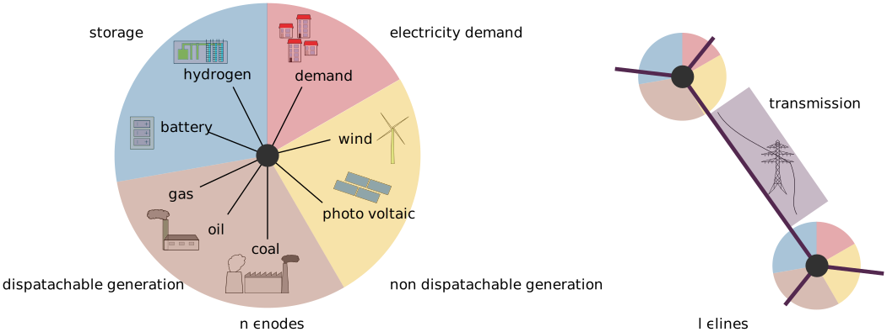

# Optimization Capacity Expansion Problem

## General
The capacity expansion problem (CEP) is designed as a linear optimization model. It is implemented in the algebraic modeling language [JUMP](http://www.juliaopt.org/JuMP.jl/latest/). The implementation within JuMP allows to optimize multiple models in parallel and handle the steps from data input to result analysis and diagram export in one open source programming language. The coding of the model enables scalability based on the provided data input, single command based configuration of the setup model, result and configuration collection for further analysis and the opportunity to run design and operation in different optimizations.



The basic idea for the energy system is to have a spacial resolution of the energy system in discrete nodes. Each node has demand, non-dispatchable generation, dispatachable generation and storage capacities of varying technologies connected to itself. The different energy system nodes are interconnected with each other by transmission lines.
The model is designed to minimize social costs by minimizing the following objective function:

```math
min \sum_{account,tech}COST_{account,'EUR/USD',tech} + \sum LL \cdot  cost_{LL} + LE \cdot  cos_{LE}
```
