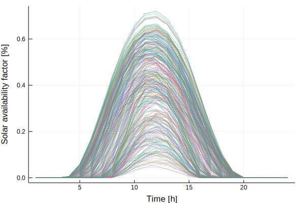
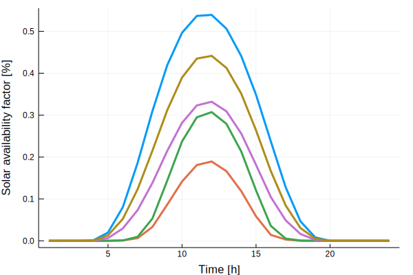

Preparing ClustData
=========
Here, we first describe how to load provided time-series input data or your own time-series input data as `ClustData`. We second describe how to aggregate the loaded time-sereis input data.

## Provided Data
`load_timeseries_data_provided()` loads the data for a given `region` for which data is provided in this package.
The optional input parameters to `load_timeseries_data_provided()` are the number of time steps per period `T` and the `years` to be imported.

```@docs
load_timeseries_data_provided
```
## Your Own Data
For details refer to [TimeSeriesClustering](https://github.com/holgerteichgraeber/TimeSeriesClustering.jl)

!!! note
    The keys of `{your-time-series}.data` have to match `"{time_series (as declared in techs.csv)}-{node}"`

```@docs
load_timeseries_data
```
## Aggregation
Time series aggregation can be applied to reduce the temporal dimension while (if done problem specific correctly) keeping output precise.
Aggregation methods are explained in [TimeSeriesClustering](https://github.com/holgerteichgraeber/TimeSeriesClustering.jl)
High encouragement to run a second stage validation step if you use aggregation on your model. [Second stage operational validation step](@ref)

## Examples
### Loading time series data
```julia
using CapacityExpansion
state="GER_1"
# load ts-input-data
ts_input_data = load_timeseries_data_provided(state; T=24, years=[2016])
using Plots
plot(ts_input_data.data["solar-germany"], legend=false, linestyle=:dot, xlabel="Time [h]", ylabel="Solar availability factor [%]")
```

### Aggregating time series data
```julia
ts_clust_data = run_clust(ts_input_data;method="kmeans",representation="centroid",n_init=50,n_clust=5).best_results
plot(ts_clust_data.data["solar-germany"], legend=false, linestyle=:solid, width=3, xlabel="Time [h]", ylabel="Solar availability factor [%]")
```

